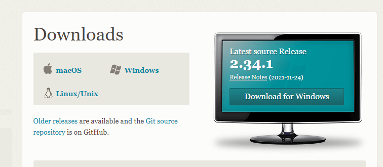
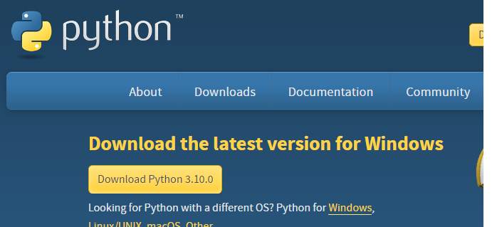
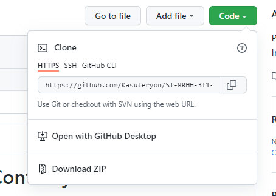
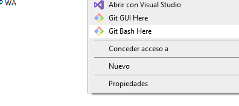
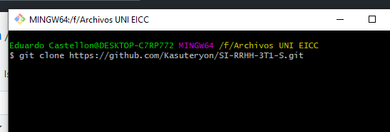
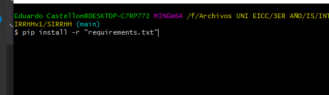
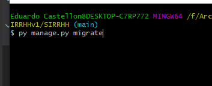
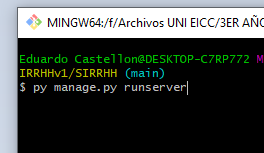
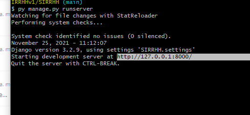

# Sistema de Información para Control y Gestión de Recursos Humanos (SIRRHH)  

## Proyecto de curso de la asignatura de Ingeniería de Software IES - UNI 

### Mini Guía de Instalación del Etorno de Ejecución y Plugins

## Elaborado por:
- Eduardo Castellón
- Carlos Tapia
- Ashly Ramos
- Josías Nicaragua
- María Valverde
- Nayely Martinica

### Requisitos para la Instalación del Entorno de Ejecución

### GIT para Windows

Link:
<https://git-scm.com/downloads>

#### MySQL WorkBench 8.0

Link:
<https://www.mysql.com/products/workbench/>

#### Python en su última versión

Link:
<https://www.python.org/downloads/>

## Pasos

#### 1. Clonar el repositorio, copiando la URL mostrada o descargando el ZIP

##### En caso de clonarlo, se deposita en la consola de git en un directorio

##### En la consola de git abierta escribimos 'git clone' y pega

#### Ahi se encuentran los directorios de las BD y el código fuente.

#### 2. Navegar hasta el código fuente y ejecutarlo.

Abre una consola de git ahí mismo y navega 'cd SI-RRHH-3T1-S/SIRRHHv1/SIRRH'

Luego, aplicar el siguiente comando python (que ya debería estar instalado) para instalar los plugins:

#### 3. Hacer las migraciones del ORM con el siguiente comando:

#### 4. Si todo se ha hecho correctamente se hace el siguiente comando:

#### 5. Ejecutalo en el navegador abriendo la URL

Se tiene que copiar y pegar la ruta sombreada