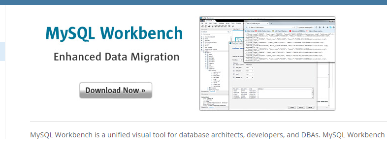

# Sistema de Información para Control y Gestión de Recursos Humanos (SIRRHH)  

## Proyecto de curso de la asignatura de Ingeniería de Software IES - UNI 

### Mini Guía de Instalación del Etorno de Ejecución y Plugins

## Elaborado por:
- Eduardo Castellón
- Carlos Tapia
- Ashly Ramos
- Josías Nicaragua
- María Valverde
- Nayely Martinica

### Requisitos para la Instalación del Entorno de Ejecución

#### MySQL WorkBench 8.0

<https://www.mysql.com/products/workbench/>